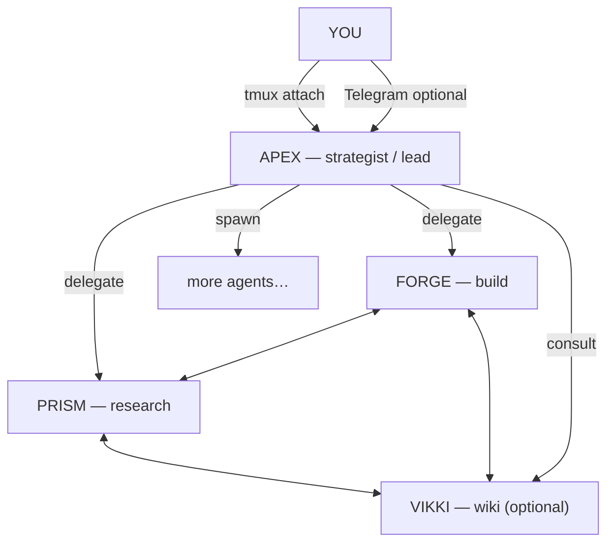

# opencode-fleet-lite

A small **example** drop-in fleet of **OpenCode** agents that work together on your machine (core trio **+** an optional **Vikki** wiki-memory agent). Configure once, run `./start.sh`, then talk to the fleet in **one** place: **`tmux attach -t apex`**, or **Telegram** if you enable the optional bridge. **Apex** is the lead — Forge, Prism, and any agents you add later coordinate through that node so the fleet can ship work as a team.

**KISS — Keep It Simple, Stupid:** coordination is intentionally boring on purpose. Each agent is a **tmux** session; agents reach each other by **paste-buffer injection** — plain text dropped into the peer’s terminal — not a bespoke message bus, not another service to babysit. **That is why this stack is tmux-first:** fewer moving parts, easier to read, trivial to debug in a scrollback.

**Lite on purpose:** there is **no** systemd and **no** watchdog to resurrect sessions after a reboot or a killed tmux pane. Detach when you are done (`Ctrl+B`, then `D`); whatever you leave running is what stays up. That keeps the repo easy to read and adapt without ops glue in the way.

Use it to learn the pattern — separate agent nodes, skills, and messages passing between them — then take it further: new roles, more agents, or your own hardening when you are ready.

Built for [OpenCode](https://github.com/sst/opencode). Model choice lives in **your** OpenCode setup, not in this repo.

---

## What you get

Four core roles (plus spawns), one mesh: you steer from **Apex**, the rest execute, cross-check, and can **ping each other directly** — delegation is not a one-way hose. Need another specialist? Ask Apex to **spawn** one; it wires the folder, prompt, tmux session, and roster so a new node joins the fleet without you hand-copying templates.

| Agent | Role |
|-------|------|
| **Apex** | **Strategist & your interface** — breaks down work, delegates, tracks outcomes. **You only attach here** (tmux or Telegram). |
| **Forge** | **Builder** — ships code, scripts, fixes; reports back when something is done or blocked. |
| **Prism** | **Analyst** — research, review, structured notes; curates `prism/memory/shared.md` the fleet can read. |
| **Vikki** | **Wiki & project memory** (optional) — Obsidian-style **`vikki/memory/fleet-wiki/`** (`00-MOC-Fleet.md`, `fleet/`, `projects/<slug>/`); complements Prism’s shared file, does not replace it. |
| **Anyone new** | Ask Apex (e.g. *“add an agent called Scout for security review”*). Apex creates the agent using **`/spawn-agent`** — folders, `AGENT.md`, tmux session, roster updates — you get a new node in the fleet without manual scaffolding. |

Forge and Prism come up when Apex runs the roster sweep (`ensure-fleet-up.sh`); you stay in **Apex** unless you *want* to peek at another pane. **Vikki is opt-in** — if you want the wiki-memory agent, ask Apex to add Vikki to the roster (setup lives in `vikki/SETUP.md`). Optional **Telegram** still lands on Apex first.

**Who talks to whom**

You only message **Apex**. Inside the fleet, **any agent can message any agent** — Forge can ask Prism for a review, Prism can nudge Apex for a decision, and so on. Apex remains your single front door; behind it, the team is a **mesh**, not a strict ladder.

```
                         +-----------+          
                         |    YOU    |          
                         +-----------+          
                          /         \           
            tmux attach       Telegram (opt.)   
                  |                   |         
                  v                   v         
             +=============================+    
             |            APEX             |    
             |      strategist / lead      |    
             |  plans, delegates, spawns   |    
             +=============================+    
                /          |          \         
          delegate     delegate     spawn       
              /          |            \         
        +----------+  +----------+  +----------+
        |  FORGE   |  |  PRISM   |  |  VIKKI   |
        |  build   |  | research |  | wiki/mem |
        +----------+  +----------+  +----------+
             \            |            /        
              \     direct comms      /         
               +--- any <-> any -----+          
                  (tmux injection)              
```

Same structure in **Mermaid** (renders on GitHub):



All comms are **tmux paste-buffer** injection — no extra services, HTTP, or queues.

---

## Optional: Vikki (wiki memory)

Vikki is **opt-in**. Details and enable/disable steps are at the **bottom** of this README (and in `vikki/SETUP.md`).

---

## Prerequisites

- **OpenCode** installed and working, with **your LLM configured** (check with `opencode --version` and your usual provider setup).
- **tmux** — required; it is the **KISS** transport for agent-to-agent comms (see [How fleet comms work](#how-fleet-comms-work) at the end).
- **Optional — for Telegram:** Node.js 20+ and npm (only if you enable the bridge).

---

## Install and run

Goal: **clone → `./start.sh` → attach to Apex** — no manual env file step. **`start.sh` creates `.env` from `.env.example` the first time** if needed. **Telegram is optional** — edit `.env` only when you want the bridge.

### Quick start (three steps)

1. **Clone and enter the repo**

   ```bash
   git clone https://github.com/jarvis-thi/opencode-fleet-lite.git fleet
   cd fleet
   ```

2. **Start the fleet**

   ```bash
   ./start.sh
   ```

   On first run, **`start.sh` creates `.env` from `.env.example`** if `.env` is missing — you do **not** copy anything by hand. Local use needs no edits; the file is there for when you add Telegram later.

  This launches **Apex** in tmux. **`start.sh` does not start Forge or Prism** — Apex runs **`scripts/ensure-fleet-up.sh` on each user message** so roster peers get a tmux session before delegating. (Optional peers like Vikki only come up if added to the roster.)

3. **Talk to Apex**

   ```bash
   tmux attach -t apex
   ```

   Chat with Apex using your normal OpenCode workflow. Ask something small to start with (e.g. *“Summarise what this fleet can do”* or *“What would you delegate to Forge vs Prism?”*), then try a slightly larger task and watch Apex route work.

**Detach** without killing the session: **Ctrl+B**, then **D**.

That is enough to **see how things work** — Apex coordinates, other agents join when needed, and you stay in one session.

### How Apex should keep you updated

**Apex** is configured to communicate like a good lead operator:

- **Fast ack** — a short line so you know it heard you when the ask is non-trivial.
- **Says when it sends work to the fleet** — e.g. who it messaged (Forge / Prism / …) and for what.
- **Says when fleet work finishes** — outcome, result path, or blocker, in one clear update.

That applies **in tmux** (everything you read in the Apex pane) and, if you enable Telegram, **on Telegram** too (Apex replies via the bridge — not silent side effects).

### Optional: Telegram (only when you want it)

Skip this until you care about phone access. **`./start.sh` already created `.env`** — open it and set **`TELEGRAM_BOT_TOKEN`** and **`TELEGRAM_CHAT_ID`** (from @BotFather and your chat id).

Then:

```bash
cd telegram/bridge && npm install && cd ../..
./start.sh
```

That starts **`fleet-telegram`** if the token is set. Messages hit Apex the same way as in tmux; Apex should **still** ack, announce delegations, and close the loop when work completes.

You can use **Telegram-only** for chat if Apex is already running — no tmux attach required — but Apex must be up.

---

## Stop and check status

```bash
./status.sh   # which tmux sessions are up
./stop.sh     # graceful prompt, then stops apex / roster peers / fleet-telegram
```

---

## Repository layout (overview)

```
fleet/
  start.sh   stop.sh   status.sh   .env
  apex/      # Lead agent — AGENT.md, skills, scripts/ensure-fleet-up.sh, memory, comms
  forge/     # Builder
  prism/     # Analyst + shared knowledge file
  vikki/     # Optional — fleet wiki + per-project memory
  telegram/  # Optional bridge (Grammy) + MCP for replies
```

Per-agent details live next to each agent (`AGENT.md`, `opencode.json`, `memory/`, `skills/`).

---

## Memory

**Per agent:** each node has a `memory/` folder — **`bootstrap.md`**, **`handoff.md`**, **`log.md`**. The agents write these as they work.

**Fleet-wide (Prism):** **`prism/memory/shared.md`** — lightweight notice board.

**Structured wiki (optional):** **`vikki/memory/fleet-wiki/`** — Vikki’s Obsidian-style graph; see [Optional: Vikki (wiki memory)](#optional-vikki-wiki-memory).

**Example, not scripture.** If you prefer a different memory pattern — **ask Apex** to retune **`skills/`** across the fleet.

---

## Customization — talk to Apex

**Specialists live in `skills/`:** each agent has a `skills/` folder of small markdown playbooks. That is how a generic node becomes a **specialist** — tighter reviews, domain checklists, custom delegation habits — **without** forking OpenCode.

**Work with Apex — you do not have to edit everything by hand.** Ask Apex to:

| Ask for… | What Apex does |
|----------|----------------|
| **Sharpen an agent** | Refine `AGENT.md`, add or rewrite **`skills/*.md`**, align voice and responsibilities (Forge as release engineer, Prism as threat analyst, …). |
| **New capabilities** | Create new skill files under the right agent’s `skills/`, wire them into how that agent should behave. |
| **Improvement loops** | Set up habits: what to log after a task, when to update **`prism/memory/shared.md`**, retros, “what we learned” nudges — encoded as skills + memory, not buzzwords. |
| **A brand-new node** | **`/spawn-agent`** — new folder, tmux session, roster (see `apex/skills/spawn-agent.md`). Optional wiki stub via **`apex/skills/wiki-memory.md`**. |
| **Evolve the fleet you have** | **`/tune-fleet`** — Apex updates agents in place; see `apex/skills/tune-fleet.md`. |
| **An agent is DOWN / comms fail** | **`/recover-fleet`** or **`/recover-agent <name>`** — status, `tmux` restart lines, verification; see `apex/skills/recover-fleet.md`. |
| **Keep the fleet warm** | On **every user message**, Apex runs **`apex/scripts/ensure-fleet-up.sh`** (driven by **`apex/comms/roster.sh`**) so **Forge**, **Prism**, **Vikki (if enabled)**, and **every spawned peer** in the roster get a tmux session before comms. |

**Models and tone at the engine level** still come from **your** OpenCode config. **Persona and fleet behavior** come from **`AGENT.md` + skills** — and Apex is the partner for rolling those forward.

---

## How fleet comms work

**Idea:** each agent runs **OpenCode inside its own tmux session** (`apex`, `forge`, `prism`, or whatever you spawned). To contact another agent, the sender runs **`comms/send.sh`** from its tree — the script resolves the target session, formats a line, and **injects it with tmux** (`load-buffer` from a temp file → `paste-buffer` into the peer’s pane, **0.5s pause**, then Enter — same family as production fleet MCP injectors). The peer sees new text appear as if it arrived on the wire; no broker, no extra port — **the terminal is the inbox.**

**Message shape** (same vocabulary for every agent):

```
[Sender to Receiver] TYPE | body text… END
```

**Types:**

| Type | Meaning |
|------|---------|
| **REQUEST** | Do something — receiver should **ACK** |
| **REPORT** | Status, result, or findings |
| **ACK** | Got it — **never ACK an ACK** |
| **ESCALATE** | Needs a human |
| **INFO** | FYI only |

Every message ends with **`END`** so boundaries stay obvious in a busy terminal.

**Mesh:** any agent can message any agent (not only Apex → others). You still talk to **Apex** as the human-facing lead; under the hood, Forge can ping Prism, Prism can ping Apex, and so on — all with the same pattern.

That is the whole transport story — **KISS**, inspectable, grep-friendly.

---

## Agent personas & the “fleet army” pattern

This repo is a **template for building many agents** that cooperate. You do **not** need a bespoke platform — only **OpenCode**, **tmux**, and markdown. Each shipped agent below is **only** persona markdown + skills + tmux — the “army” scales by copying folders and rosters.

### How personas and skills stack

| Layer | File | What it does |
|-------|------|----------------|
| **`opencode.json`** | Per agent | Sets `systemPrompt` → `AGENT.md`; optional MCP (e.g. Telegram on Apex only). |
| **`AGENT.md`** | Per agent | Identity, voice, **do/don’t**, roster, comms protocol, memory contract — the **persona** the model loads every session. Keep it tight. |
| **`skills/*.md`** | Per agent | Playbooks: slash-style habits (`/delegate`, `/review`, …), checklists, recovery steps. Iterate here without rewriting the whole prompt. |
| **OpenCode / LLM config** | Outside repo | Model, temperature, tools — not pinned in this tree. |

Adding a specialist: **`/spawn-agent`** (Apex) or copy an existing agent tree, rewrite **Identity + skills**, update **every** `comms/roster.sh`, and add the peer to **`apex/comms/roster.sh`** so **`ensure-fleet-up.sh`** starts them. Optional: enable Vikki and **`/delegate vikki`** to stub `fleet-wiki/projects/<slug>/` (see [Optional: Vikki (wiki memory)](#optional-vikki-wiki-memory)).

*See also [Customization — talk to Apex](#customization--talk-to-apex) for `/tune-fleet` and fleet-wide retunes.*

---

### Apex — strategist & human interface

| Aspect | What we did |
|--------|-------------|
| **Role** | Sole routine interface for the user (tmux + optional Telegram). Decomposes work, delegates, spawns agents, **never writes application code**. |
| **Voice** | Calm, methodical, plain-spoken — no filler. |
| **Differentiator** | **Fleet liveness:** runs `scripts/ensure-fleet-up.sh` **every user message** so peers exist before comms; **recovery** skills when tmux breaks. |
| **Skills** | Under `apex/skills/`: `spawn-agent`, `delegate`, `tune-fleet`, `recover-fleet`, `wiki-memory`, `fleet-comms`, `fleet-status` — ops-heavy. |

Apex is the **officer**; others are **specialists**. **Do/don’t** is written in `apex/AGENT.md` so the model does not improvise fleet ops.

---

### Forge — builder

| Aspect | What we did |
|--------|-------------|
| **Role** | Ships code and fixes; short **REPORT**s back when done or blocked. |
| **Voice** | Terse, action-first — “doing X, result Y.” |
| **Differentiator** | Explicit boundary: **does not** run fleet ops or wiki; may **REQUEST** Prism or Vikki (if enabled) for context. |
| **Skills** | `forge/skills/fleet-comms`, `forge/skills/report` — minimal; most effort is in the work product. |

---

### Prism — analyst

| Aspect | What we did |
|--------|-------------|
| **Role** | Research, code review, structured findings; owns **`prism/memory/shared.md`** (fast, broadcast-friendly notices). |
| **Voice** | Evidence-led, headings and bullets; severity labels on reviews. |
| **Differentiator** | **Shared vs wiki:** Prism drops **session-fast** knowledge; **Vikki** (if enabled) owns **linked, long-lived** narrative in `vikki/memory/fleet-wiki/`. |
| **Skills** | `prism/skills/fleet-comms`, `prism/skills/review` — depth where Forge is breadth. |

---

### Vikki — wiki & project memory (optional)

See **Optional: Vikki (wiki memory)** at the bottom of this README for enable/disable and vault layout.

### Example spawn: **Scout** (security) — not shipped in this repo

If you **`/spawn-agent scout "…"`**, Apex creates `scout/` mirroring Forge/Prism: **`scout/AGENT.md`** defines the auditor voice, **`scout/skills/threat-review.md`** (you add) holds the checklist, **`scout/comms/roster.sh`** lists peers. Same **tmux + `send.sh`** mesh — only **persona + skills** change. Use this pattern for DBAs, release captains, or any parallel specialist.

---

### Building your own army

- **Start from one `AGENT.md`** — lock identity in three sentences, then add **only** the protocol you need.
- **Add skills as you repeat yourself** — the second time you type the same procedure, move it to `skills/<name>.md` and reference it from `AGENT.md`.
- **Keep rosters symmetric** — every agent’s `comms/roster.sh` should list peers they may message; Apex’s roster drives **auto-start**.
- **Mesh, not hierarchy** — any agent can ping any agent; Apex stays the **human** front door.

That is the **fleet army pattern**: cheap to fork, easy to read, no magic runtime beyond tmux paste and discipline in markdown.

---

## Optional: Vikki (wiki memory)

Vikki is the fleet’s **wiki-memory agent**. She owns an Obsidian-style vault under **`vikki/memory/fleet-wiki/`**:

| Surface | Owner | Role |
|---------|-------|------|
| `prism/memory/shared.md` | Prism | Fast notices (this week) |
| `vikki/memory/fleet-wiki/` | Vikki | Durable, linked truth (MOC, `fleet/`, `projects/<slug>/`) |

### Enabling Vikki

Vikki is **not** in the default roster. If you want her, ask **Apex** to add Vikki (Apex updates rosters so she auto-starts and peers can message her). The full checklist is self-contained inside the Vikki folder:

- `vikki/SETUP.md`
- `vikki/AGENT.md` + `vikki/skills/*` + `vikki/memory/fleet-wiki/*`

Once enabled, delegate durable notes like:

```
/delegate vikki "Ingest ADR: <title>. Link from fleet MOC and projects/<slug>/."
```

---

## License

MIT
